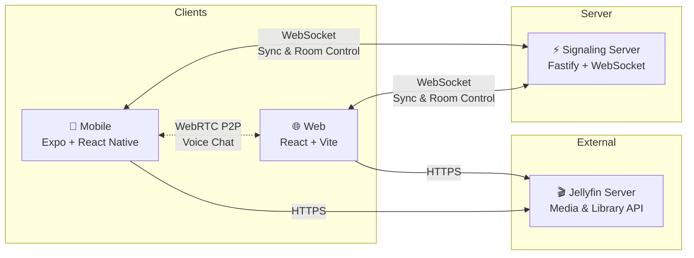

<div align="center">

# 🍿 JellySync

**Watch movies together, apart.**

A cross-platform synchronized watch party app for [Jellyfin](https://jellyfin.org) with always-on voice chat.

*Because watching a movie "together" over Discord screen-share at 720p with 3 seconds of lag isn't actually together.*

[](#tech-stack)
[](#)
[](#)
[](#project-structure)

</div>

---

## The Problem

You have a Jellyfin server full of movies. Your friend is 500 miles away. You want to watch together. What are your options?

| Solution | What Actually Happens |
|----------|----------------------|
| Discord screen-share | 720p max, audio compression, 2-3s lag |
| Teleparty / Watch2Gether | No Jellyfin support |
| Syncplay | Desktop only, manual setup, no voice |
| "Ready? 3... 2... 1... Play!" | Someone always presses late |

**JellySync fixes all of this.** Native Jellyfin integration. Hard-synced playback. Always-on voice. Two buttons.

---

## How It Works

```
🎬 Create Room  →  📤 Share Code  →  🍿 Watch Together
```

The host picks a movie from their Jellyfin library, creates a room, and shares a 6-character code. Friends join instantly. Playback stays perfectly synced — if anyone buffers, everyone pauses. Voice chat is always on, like sitting on the same couch.

---

## Features

🎬 **Hard-Synced Playback** — Sub-500ms drift. If someone buffers, everyone waits. No one misses a scene.

🎙️ **Always-On Voice Chat** — WebRTC peer-to-peer. Low-latency, like being in the same room.

📱 **Cross-Platform** — Android, iOS, and Web. Mix and match.

🏠 **Two-Button UX** — Create Room or Join Room. That's it. Watching in under 2 minutes.

🔄 **Mid-Session Movie Swap** — Change the movie without killing the room.

👤 **Stepped Away Detection** — Auto-pauses when someone leaves. Everyone knows who wandered off.

🎬 **Subtitles** — Per-user subtitle toggles. Watch your way.

🏗️ **Host Controls** — The host can lock playback controls or pass the remote.

---

## Quick Start

### Prerequisites

- [Node.js](https://nodejs.org/) >= 20.0.0
- [pnpm](https://pnpm.io/) >= 10.0.0
- A running [Jellyfin](https://jellyfin.org/) server

### Get Running

```bash
git clone https://github.com/your-username/jellysync.git
cd jellysync
pnpm install
pnpm dev
```

That's it. Turborepo spins up the web app, mobile dev server, and signaling server in parallel.

<details>
<summary><strong>Per-App Commands</strong></summary>

#### Web App
```bash
cd apps/web
pnpm dev        # http://localhost:5173
pnpm build      # Production build
pnpm test       # Run tests
```

#### Mobile App (Expo)
```bash
cd apps/mobile
pnpm dev        # Start Expo dev server
pnpm android    # Run on Android
pnpm ios        # Run on iOS
```

#### Signaling Server
```bash
cd apps/server
pnpm dev        # Start Fastify WebSocket server
pnpm test       # Run tests
```

</details>

<details>
<summary><strong>Environment Setup (Voice Chat)</strong></summary>

Copy `.env.example` to `.env` and configure your STUN/TURN servers for WebRTC:

```env
JELLYSYNC_STUN_URL=stun:stun.l.google.com:19302
JELLYSYNC_TURN_URL=turn:your-server:3478
JELLYSYNC_TURN_USERNAME=jellysync
JELLYSYNC_TURN_CREDENTIAL=jellysync-turn-secret
```

A COTURN Docker config is included for self-hosting a TURN relay:

```bash
docker compose up -d
```

</details>

---

## Architecture



**Design principle:** The server coordinates, but clients do the heavy lifting. Playback sync is server-authoritative via WebSocket. Voice is peer-to-peer via WebRTC with TURN fallback for NAT traversal.

---

## Tech Stack

| Layer | Technology | Purpose |
|-------|-----------|---------|
| **Mobile** | Expo 54 · React Native · NativeWind | Cross-platform native app |
| **Web** | React 19 · Vite · Tailwind CSS | Fast, modern web client |
| **Server** | Fastify · WebSocket | Signaling & sync coordination |
| **Shared** | TypeScript · Zustand · TanStack Query | Cross-platform state & data |
| **Voice** | WebRTC · TURN (COTURN) | Peer-to-peer low-latency audio |
| **Design** | Glassmorphic "Private Screening" theme | Cinematic, immersive UI |
| **Tooling** | Turborepo · pnpm · Vitest · ESLint | Monorepo orchestration & quality |

---

## Project Structure

```
jellysync/
├── apps/
│   ├── mobile/         # Expo React Native app
│   ├── web/            # React + Vite web app
│   └── server/         # Fastify WebSocket signaling server
├── packages/
│   ├── shared/         # Cross-platform stores, types, sync engine
│   └── ui/             # Design tokens (theme.css, utilities.css)
├── docker-compose.yml  # COTURN server for TURN relay
└── turbo.json          # Turborepo pipeline config
```

---

## Roadmap

- [x] Room creation & joining with 6-character codes
- [x] Jellyfin library browsing & movie selection
- [x] Hard-synced playback with buffer detection
- [x] Host controls & permission management
- [x] Per-user subtitles & stepped-away detection
- [x] WebRTC voice chat with TURN fallback
- [ ] Mic toggle & per-participant volume control
- [ ] Background audio optimization (mobile)
- [ ] Responsive web layout & accessibility
- [ ] Docker deployment configuration

---

## Development

```bash
pnpm lint          # ESLint across all packages
pnpm typecheck     # TypeScript strict mode
pnpm test          # Vitest across all packages
pnpm format:fix    # Prettier auto-format
```

---

## Design Philosophy

JellySync follows a **"Private Screening"** design language — a cinematic, glassmorphic aesthetic where the interface recedes to let the content shine. Deep charcoal surfaces, muted teal accents, and atmospheric depth layering create an intimate screening room feel.

> No harsh borders. No visual clutter. Just you, your friends, and the movie.

See [DESIGN.md](DESIGN.md) for the full design system specification.

---

<div align="center">

Built with 🍿 for movie nights that distance can't ruin.

</div>
