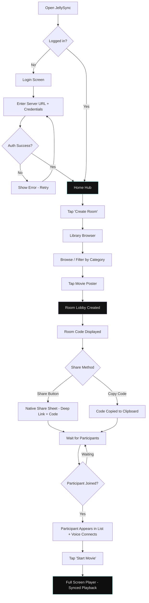
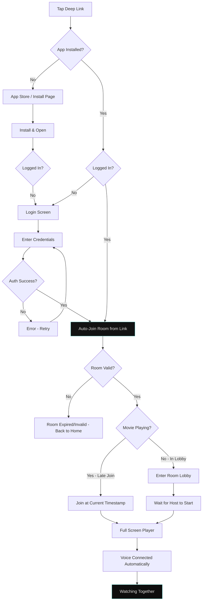
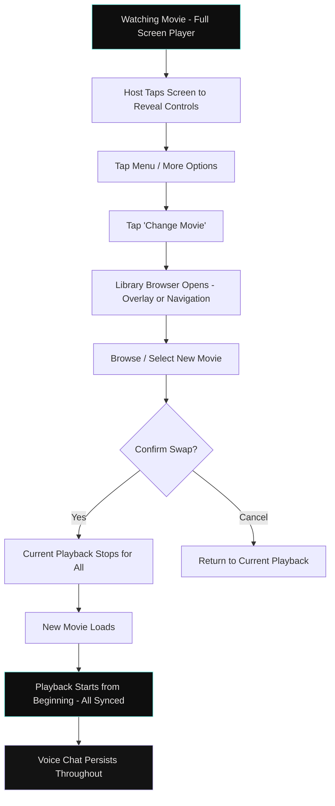
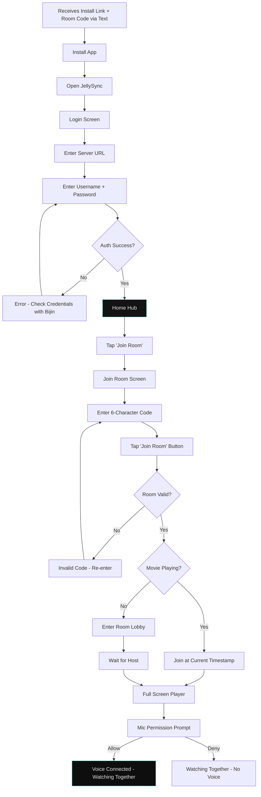

# UX Design Specification JellySync

**Author:** Bijin
**Date:** 2026-03-22

---

<!-- UX design content will be appended sequentially through collaborative workflow steps -->

## Executive Summary

### Project Vision

JellySync is a cross-platform synchronized movie-watching app purpose-built for Jellyfin. The product philosophy is radical simplicity — the app should disappear within seconds of opening it. Every design decision flows backward from one question: "are we in the same moment?" The creative north star is "The Private Screening" — an intimate, high-end editorial experience where the interface recedes to let the cinematography and human connection take center stage.

The app replaces broken workarounds (Discord screen-share, counting down "3, 2, 1, play" over a phone call) with a two-button experience: Create Room or Join Room. One person picks the movie, shares a 6-character code, and everyone is watching together within seconds with always-on voice chat.

### Target Users

**Primary: Bijin (Host / Server Admin)**
Tech-savvy user who runs the Jellyfin media server. Initiates most watch sessions — picks the movie, creates the room, shares the code. Wants the app to feel polished and effortless despite the real-time sync, WebRTC, and cross-platform complexity underneath. Success: tapping "Create Room," sharing a code, and watching together within seconds.

**Primary: Partner (Returning Participant)**
Joins sessions via room code or deep link shared over text. Logged in once with Jellyfin credentials, persistent session after that. Doesn't think about servers, transcoding, or networking. Wants it to feel like sitting on the same couch. Success: tap the link, hear Bijin's voice, movie starts.

**Secondary: Friends & Family (Occasional Participants)**
Join less frequently, may need a one-time login walkthrough. Jellyfin account pre-created by Bijin. The bar: if a non-tech family member can join without help, the UX is right.

### Key Design Challenges

1. **Sacred Screen vs. Discoverability** — Playback UI must be invisible during watching yet instantly accessible when needed. The tap-to-reveal pattern must feel natural without accidental triggers or lost controls.

2. **Cross-Platform Premium Consistency** — The editorial design system (glassmorphism, tonal layering, Manrope/Inter typography) must feel premium and native on Android, iOS, and Web while maintaining pixel-level consistency in the design language.

3. **Zero-Config Voice UX** — Mic-on-by-default requires careful UX for permission handling, mute state visibility (without breaking the sacred screen), and graceful degradation when voice fails.

4. **Buffer Sync Communication** — When everyone pauses because one participant buffers, the UX must make this feel natural and communal ("we're waiting together") rather than broken.

5. **Non-Technical Onboarding** — The Jellyfin server URL concept is unfamiliar to casual users. First-time setup must guide without overwhelming, while returning users skip it entirely via persistent sessions.

### Design Opportunities

1. **Deep Link Magic** — The tap-link-to-watching journey (under 10 seconds for returning users) can feel like genuine magic. This is the product's "wow moment" and should be treated as the signature UX achievement.

2. **Voice as Ambient Presence** — No competitor treats voice this way. The "invisible mic" philosophy — always on, no indicators, no push-to-talk — is a genuine differentiator that the design system's atmospheric approach supports perfectly.

3. **Room Lobby as Anticipation** — The waiting-for-others moment is emotionally charged (excitement before movie night). The lobby UX can elevate this from a loading state into a social moment that builds anticipation.

## Core User Experience

### Defining Experience

The defining experience of JellySync is **joining the same moment** — the seamless transition from "let's watch" to "we're watching together." Whether creating a room and sharing a code, or tapping a deep link and landing in a synced session, every design decision serves this singular transition. The product's value is realized the instant two people are watching the same frame, hearing each other's reactions, and forgetting the technology between them.

The core loop is deceptively simple: Create/Join Room → Watch Together → Exit Naturally. The complexity lives entirely beneath the surface — real-time sync, WebRTC voice, per-user transcoding — while the user experiences only the movie and each other's presence.

### Platform Strategy

- **Mobile (Primary):** React Native for Android (primary dev target) and iOS. Touch-first design with mobile-native gestures. Background audio required for voice chat continuity when app is backgrounded or screen locks.
- **Web:** React SPA. Mouse/keyboard interaction with responsive layout. WebRTC and MediaSource API required. No SEO, PWA, or offline requirements.
- **Shared Core:** TypeScript sync engine, room management, Jellyfin API client, and state management shared across all platforms.
- **Distribution:** Sideloaded (APK for Android, TestFlight/ad-hoc for iOS), web hosted directly.
- **Platform Capabilities Leveraged:** Deep links (Android intents, iOS universal links, web URL routing), platform AEC for echo cancellation, secure credential storage (Keychain/Keystore/encrypted web storage).

### Effortless Interactions

1. **Returning user join** — Tap deep link, land in room with voice connected, movie playing. Under 10 seconds, zero taps beyond the link itself.
2. **Room creation** — Tap Create Room, browse library, select movie, share code. Under 8 seconds for the host.
3. **Voice presence** — Mic on by default, no setup, no "can you hear me?" troubleshooting. Voice is simply there like ambient room sound.
4. **Sync invisibility** — Play, pause, seek, and buffer recovery happen across all participants without anyone needing to coordinate. The sync is only noticed in its absence.
5. **Persistent session** — Login once, never again. The app remembers the server, the credentials, and the session across restarts.

### Critical Success Moments

1. **The First Laugh Together** — Hearing each other react to the same scene simultaneously. This is the moment users know JellySync works and trust it. Every millisecond of sync drift and voice latency matters here.
2. **The Deep Link Join** — Tapping a shared link and landing in the room with voice already connected. If this feels like magic, the product earns repeat use.
3. **The Communal Pause** — When one person buffers and everyone pauses together. If this feels like "we're waiting for you" rather than "the app broke," trust in the sync is established permanently.
4. **First-Time Family Join** — A non-technical family member goes from install to watching without asking for help. If this works, the onboarding is right.

### Experience Principles

1. **The App Disappears** — Every interaction should minimize time-in-app. Success is measured by how quickly users forget they're using software.
2. **Togetherness Over Technology** — Technical features (sync, transcoding, WebRTC) must be invisible. Users experience connection, not infrastructure.
3. **The Sacred Screen** — During playback, the movie owns every pixel. UI is summoned, never imposed.
4. **Two Taps to Together** — No journey should require more than two deliberate actions to reach the shared experience.
5. **Graceful Presence** — Voice, sync states, and participant awareness should feel ambient — like sensing someone in the room, not reading a notification.

## Desired Emotional Response

### Primary Emotional Goals

**Intimacy** — The core emotional target. JellySync should feel like sharing a couch, not using a collaboration tool. The product succeeds when users feel genuinely together, not technically connected.

**Effortless Confidence** — Users should never question whether the app is working. Every interaction should reinforce "this just works" without requiring proof or status indicators.

**Immersion** — During playback, users should forget the technology entirely. The emotional state is "watching a movie together," not "using an app that syncs video."

### Emotional Journey Mapping

| Moment | Desired Feeling | Design Driver |
|--------|----------------|---------------|
| Opening the app | **Anticipation** — "movie night is happening" | Cinematic dark atmosphere, "Ready for a Private Screening?" editorial headline |
| Creating/sharing a room | **Effortless confidence** — "this just works" | Two taps, instant code, one-tap share |
| Hearing the other person's voice | **Warmth / presence** — "they're here" | Voice arriving without setup, zero configuration |
| During the movie | **Immersion / togetherness** — "same couch" | Sacred screen, ambient voice, invisible sync |
| Someone buffers | **Patience, not frustration** — "we're waiting together" | Communal pause, no blame assignment, auto-resume |
| Credits roll | **Satisfaction / lingering connection** — "that was a good night" | No forced closure, voice persists, exit when ready |
| Something goes wrong | **Trust, not anxiety** — "it'll sort itself out" | Graceful recovery, non-alarming visual treatment |
| Returning next week | **Comfort / ritual** — "our Friday night thing" | Persistent session, familiar home screen, zero re-setup |

### Micro-Emotions

**Belonging over Isolation** — The most critical emotional axis. Every design choice must reinforce "we're in this together." Participant awareness through voice presence (not visual indicators) is the primary vehicle.

**Trust over Skepticism** — The sync and voice must earn trust in the first session and never break it. This means zero "is it working?" moments — no sync drift the user can perceive, no voice drops, no unexplained pauses.

**Delight over Mere Satisfaction** — The deep link join, the instant voice connection, the communal pause — these should feel like small moments of magic that elevate the experience beyond functional.

**Confidence over Confusion** — Every screen should have an obvious next action. The two-button home screen, the prominent room code, the single Join button — clarity is non-negotiable.

### Emotions to Avoid

- **Confusion** — "where do I go?" / "what does this mean?" — eliminated through radical simplicity and obvious information hierarchy
- **Self-consciousness** — "am I being heard?" / "is my mic on?" — eliminated by making voice the default state, not an opt-in
- **Technical anxiety** — "is it syncing?" / "did it break?" — eliminated by making sync invisible and errors recoverable without user action
- **Isolation** — feeling alone despite being in a shared session — eliminated through always-on voice and communal sync behavior

### Emotional Design Principles

1. **Design for the Living Room, Not the Control Panel** — Every UI element should feel like furniture in a room, not buttons in a cockpit. Warm, atmospheric, receding.
2. **Silence is Presence** — The absence of UI noise (no badges, no status dots, no sync indicators) communicates confidence and trust. The app is quiet because everything is working.
3. **Errors are Moments, Not States** — When something goes wrong, treat it as a brief shared moment ("waiting for everyone...") rather than an error state. No red alerts, no technical language.
4. **The Emotional Gradient** — Anticipation (home) → Excitement (lobby) → Immersion (playback) → Satisfaction (end). The UI tone should subtly shift to match each emotional phase.

## UX Pattern Analysis & Inspiration

### Inspiring Products Analysis

**FaceTime / Apple Communication UX**
Zero-config calling that "just works." The pattern of tap-to-connect with no setup, no lobby, no "are you there?" directly informs JellySync's voice philosophy. FaceTime succeeds because the technology is invisible — you think about the person, not the app. JellySync's always-on mic and deep link joins borrow this same principle.

**Jellyfin Native UI**
Library browsing familiarity. JellySync's library browser should feel like coming home — same poster grid, same metadata presentation users already know from their Jellyfin server. The existing mockup already achieves this with the 3-column poster grid and category chips.

**Spotify Group Session / SharePlay**
The concept of shared media state — one person controls, everyone experiences. Spotify's "one tap to join" via shared link and automatic session sync directly maps to JellySync's room code + deep link model. Where Spotify falls short (no voice, no hard sync) is exactly where JellySync differentiates.

### Transferable UX Patterns

**Navigation Patterns:**
- **Two-action home screen** (inspired by messaging apps like WhatsApp/Telegram) — a primary action surface with minimal choices. JellySync's Create/Join mirrors the "new chat / existing chat" pattern users already understand.
- **Tap-to-reveal player controls** (standard in Netflix, YouTube, Apple TV) — controls hidden during playback, revealed on tap, auto-hide after inactivity. Proven pattern that supports the sacred screen principle.

**Interaction Patterns:**
- **OTP-style code entry** (inspired by verification flows) — the 6-character input with individual boxes is a well-understood pattern that makes code entry feel deliberate and error-resistant. Already implemented in the Join Room mockup.
- **Deep link instant-join** (inspired by Zoom/Meet invite links) — one tap from any messaging app lands you in the session. The key improvement over Zoom: no interstitial "open in app?" confusion.

**Visual Patterns:**
- **Glassmorphism for floating UI** (Apple visionOS, iOS control center) — frosted glass surfaces communicate "temporary overlay" without breaking immersion. Already core to the design system.
- **Tonal layering over borders** (Material You dark themes) — elevation through surface color shifts rather than lines. Supports the "Private Screening" atmospheric depth.

### Anti-Patterns to Avoid

- **Discord's screen-share model** — one person's quality for everyone, degraded streams, no individual transcoding. Technical limitation presented as a feature. JellySync must never expose transcoding complexity but must deliver per-user quality.
- **Syncplay's technical setup** — requiring users to configure clients, enter server addresses, and manually sync. The "power user" trap that excludes non-technical participants.
- **Teleparty's browser-only lock-in** — platform restriction masquerading as simplicity. JellySync's cross-platform parity is a direct response to this limitation.
- **Zoom's "you're on mute" culture** — the mic-off-by-default pattern creates self-consciousness and "can you hear me?" friction. JellySync's mic-on-by-default is a deliberate inversion.
- **Over-communicating sync state** — showing sync indicators, latency numbers, or connection quality badges during playback. This creates technical anxiety. The sync should be invisible unless it fails.

### Design Inspiration Strategy

**Adopt:**
- FaceTime's zero-config connection philosophy — voice should arrive without user action
- Standard tap-to-reveal player controls — proven pattern, no need to reinvent
- OTP-style code entry — familiar, deliberate, error-resistant

**Adapt:**
- Spotify's group session model — add hard sync and voice, remove the social/playlist complexity
- Material You tonal layering — push further into the "Private Screening" atmospheric territory with deeper darks and more dramatic glass effects

**Avoid:**
- Any pattern that exposes technical state to the user (sync drift, bitrate, connection quality)
- Any pattern that requires explicit opt-in for core features (push-to-talk, manual sync)
- Any "are you still watching?" interruptions that break immersion

## Design System Foundation

### Design System Choice

**Hybrid: Custom Design System on Material Design 3 Foundations**

JellySync uses Material Design 3's structural token system as its architectural base, with a fully custom visual identity — "The Private Screening" — layered on top. This provides proven component patterns and accessibility defaults while delivering the premium, cinematic aesthetic the product demands.

### Rationale for Selection

- **Solo developer efficiency** — Material Design's proven component patterns reduce design decision fatigue for standard interactions (buttons, inputs, chips, navigation) while freeing creative energy for the custom elements that define JellySync's identity.
- **Cross-platform token consistency** — Material Design 3 tokens (surface hierarchy, color roles, elevation system) map cleanly across React Native (NativeWind) and React (Tailwind CSS), ensuring visual parity with a single token source.
- **Custom aesthetic demands** — The "Private Screening" editorial vision — glassmorphism, atmospheric depth, tonal layering, no-line rule — requires substantial customization beyond any off-the-shelf system. Material provides the skeleton; the custom system provides the soul.
- **Proven dark theme architecture** — Material's surface container hierarchy (`lowest` → `low` → `container` → `high` → `highest`) directly supports the atmospheric layering system, with custom values tuned for cinematic darkness.

### Implementation Approach

- **Token Layer:** Material Design 3 color tokens customized to the JellySync palette — Primary (Muted Teal `#6ee9e0`), Secondary (Soft Violet `#c8bfff`), Surface (Deep Charcoal `#131313`), with full container hierarchy.
- **Styling Layer:** Tailwind CSS (web) and NativeWind (React Native) consuming shared design tokens via a unified Tailwind config.
- **Iconography:** Material Symbols Outlined at 2px stroke weight, consistent across all platforms.
- **Typography:** Manrope (headlines/display) and Inter (body/labels) — replacing Material's default Roboto to achieve the editorial voice.

### Customization Strategy

**Custom Beyond Material:**
- **Glassmorphism system** — `surface_variant` at 60% opacity with `backdrop-filter: blur(20px)` for all floating elements (modals, player controls, navigation bars)
- **Signature Glow CTAs** — Primary buttons use a `primary` → `primary_container` gradient at 135° rather than flat Material filled buttons
- **Atmospheric Layering** — Tonal surface shifts replace Material's default elevation shadows. Ambient shadows (`0 20px 40px rgba(0,0,0,0.4)`) reserved for floating elements only.
- **Ghost Borders** — `outline_variant` at 15% opacity for accessibility boundaries that don't break immersion
- **No-Line Rule** — 1px solid borders strictly prohibited; boundaries defined through tonal shifts and negative space
- **Rim Lighting** — Subtle inner-glow (1px white at 5% opacity) on movie poster top edges for cinematic depth

**Standard Material Retained:**
- Touch target sizing (48px minimum)
- Color role relationships (on-surface, on-primary, etc.)
- Spacing scale foundations
- Accessibility contrast ratios
- Component interaction patterns (press scale, state layers)

## Defining Core Experience

### Defining Experience

**"Tap a link, hear their voice, watch together."**

This is JellySync's defining sentence — the interaction users would describe to a friend. It captures the three-beat rhythm that makes the product special: effortless entry (deep link), immediate human presence (voice), and shared experience (synced playback). Every screen, every component, and every transition in the app exists to serve this moment.

The defining experience is not "syncing video" or "managing rooms" — it's the feeling of suddenly being together. The technology is the means; the togetherness is the product.

### User Mental Model

**What users bring:**
Users' mental model for "watching together remotely" is shaped by two dominant experiences:
1. **The phone call model** — "let's count down and hit play at the same time." Manual, fragile, requires constant coordination. Users expect friction because they've always had it.
2. **The screen-share model** — Discord/Zoom where one person streams and everyone else watches a degraded feed. Users expect compromise — either quality suffers or sync drifts.

**What JellySync must replace:**
JellySync needs to overwrite both mental models with a new one: **the living room model**. You don't "sync" when you're on the same couch. You don't "share your screen." You just sit down and the movie is playing for both of you. Voice isn't a feature — it's the ambient sound of being in the same room.

**Where confusion is likely:**
- First-time users may look for a "call" button because they expect voice to be separate from the room
- Users may expect to see a sync indicator because they don't trust that sync is happening
- The Jellyfin server URL concept is foreign to non-technical users — they think in terms of "app login," not "server connection"

### Success Criteria

The defining experience succeeds when:

| Criterion | Measure |
|-----------|---------|
| **Instant presence** | Voice connects within 2 seconds of joining a room — no "can you hear me?" |
| **Invisible sync** | Users never notice sync working. No drift > 500ms. No manual re-sync needed. |
| **Two-tap entry** | Returning user goes from deep link tap to watching in under 10 seconds |
| **Zero-config voice** | Mic permission requested once, voice works automatically every session after |
| **The forgetting test** | After the movie, users talk about the film, not the app |
| **The ritual test** | Users reach for JellySync by default for movie night without considering alternatives |

### Novel UX Patterns

JellySync combines familiar patterns in a novel way rather than inventing new interactions:

**Established patterns retained:**
- Tap-to-reveal player controls (Netflix/YouTube proven pattern)
- OTP-style 6-character code entry (universal verification pattern)
- Deep link → in-app destination (Zoom/Meet proven pattern)
- Poster grid library browsing (Jellyfin/Plex familiar layout)

**Novel combinations that define JellySync:**
- **Voice-as-default in a media app** — No media player has mic-on-by-default. Communication apps do, media apps don't. JellySync bridges this gap by treating voice as ambient presence rather than a communication feature.
- **Communal buffering** — No streaming app pauses for someone else. This is a novel social contract encoded in UX: "we wait together." No education needed — the pause just happens, and users intuit why.
- **Sacred screen with ambient voice** — The combination of zero UI during playback with always-on voice creates a new interaction paradigm: the screen is passive (movie), the audio layer is active (movie + voice). No existing app layers media and communication audio this way.

**No user education required** — Every individual interaction uses familiar patterns. The novelty is in how they combine, and that combination is experienced, not learned.

### Experience Mechanics

**The Defining Flow: "Tap a link, hear their voice, watch together"**

**1. Initiation — The Link Tap**
- Trigger: User taps a deep link received via text/messaging app
- System: App opens → detects room ID from link → validates session (already logged in) → joins room
- If not logged in: Redirect to login, then auto-join room after authentication
- Duration target: < 2 seconds from tap to room entry

**2. Presence — The Voice Arrives**
- System: WebRTC connection established automatically on room join
- Feedback: User hears the other person's voice — no visual indicator, no "connected" toast. The voice IS the feedback.
- Mic: On by default. Mute toggle accessible but not prominent.
- Duration target: Voice audible within 2 seconds of room join

**3. Immersion — The Movie Plays**
- System: Playback begins at current room timestamp, individually transcoded
- Feedback: The movie filling the screen IS the success state. No "synced" badge needed during steady-state playback.
- Controls: Hidden by default (sacred screen). Tap to reveal. Auto-hide after 5 seconds of inactivity.
- Duration target: First frame visible within 3 seconds of room join

**4. Continuity — The Session Lives**
- Buffer: If anyone buffers, everyone pauses. Auto-resume when resolved. Brief, non-alarming visual treatment.
- Stepped away: Auto-pause with subtle indicator. Resume on return.
- Movie swap: Host can change movie without destroying room or voice connection.
- Exit: Tap back/exit. No confirmation dialog. Room persists for others. Credits can roll naturally.

## Visual Design Foundation

### Color System

**Palette Philosophy:** Deep obsidian tones punctuated by ethereal bioluminescent accents. The palette is designed for prolonged dark-environment viewing — movie-watching conditions where harsh colors cause eye strain.

**Core Tokens:**

| Role | Token | Value | Usage |
|------|-------|-------|-------|
| Primary | `primary` | `#6ee9e0` (Muted Teal) | Interactive elements, active states, CTAs |
| Primary Container | `primary_container` | `#4ecdc4` | CTA gradients, emphasis backgrounds |
| Secondary | `secondary` | `#c8bfff` (Soft Violet) | Labels, active participation states, metadata accents |
| Secondary Container | `secondary_container` | `#442bb5` | Syncing/live state backgrounds |
| Surface | `surface` | `#131313` (Deep Charcoal) | Main content background |
| Surface Container Lowest | `surface_container_lowest` | `#0e0e0e` | Deep immersive backgrounds (player) |
| Surface Container Low | `surface_container_low` | `#1c1b1b` | Card backgrounds on surface |
| Surface Container | `surface_container` | `#201f1f` | Elevated content areas |
| Surface Container High | `surface_container_high` | `#2a2a2a` | Interactive cards, input fields |
| Surface Container Highest | `surface_container_highest` | `#353534` | Highest elevation elements |
| On Surface | `on_surface` | `#e5e2e1` | Primary text (never pure #FFFFFF) |
| On Surface Variant | `on_surface_variant` | `#bcc9c7` | Secondary text, descriptions |
| Outline | `outline` | `#869391` | Subtle boundaries when needed |
| Outline Variant | `outline_variant` | `#3d4948` | Ghost borders at 15% opacity |
| Error | `error` | `#ffb4ab` | Error states, mute indicators |
| Tertiary | `tertiary` | `#ffcbac` | Warm accent (reserved) |

**Color Rules:**
- Never use pure `#FFFFFF` — always `on_surface` (`#e5e2e1`) for text
- 90% of screen area should remain in the `surface` / `surface_container` range
- Borders defined through tonal shifts, never 1px solid lines
- Floating elements use glassmorphism: `surface_variant` at 60% opacity + `backdrop-filter: blur(20px)`
- Primary CTAs use gradient from `primary` to `primary_container` at 135 degrees

### Typography System

**Font Pairing:** Manrope (editorial voice) + Inter (readability workhorse)

| Role | Font | Weight | Size | Letter Spacing | Usage |
|------|------|--------|------|---------------|-------|
| Display Large | Manrope | 800 | 3.5rem | -0.02em | Movie titles in hero states |
| Headline Large | Manrope | 700 | 2rem | -0.02em | Screen titles, room codes |
| Headline Medium | Manrope | 700 | 1.5rem | tight | Section headers, movie names |
| Body Medium | Inter | 400 | 1rem | normal | Descriptions, metadata |
| Label Medium | Inter | 500-600 | 0.75rem | 0.2em (uppercase) | Subtitles, status text, category labels |
| Label Small | Inter | 500 | 0.625rem | widest (uppercase) | Tertiary metadata, version text |

**Typography Rules:**
- Headlines use Manrope with tight negative letter-spacing for an "expensive, locked-in" feel
- Labels are uppercase Inter with wide tracking for editorial authority
- Pair `headline-lg` titles with `label-md` uppercase subtitles in `secondary` (Violet) for tiered hierarchy
- Primary text always `on_surface` — secondary text uses `on_surface_variant`

### Spacing & Layout Foundation

**Spacing Scale:**

| Token | Value | Usage |
|-------|-------|-------|
| `spacing.1` | 0.25rem | Micro adjustments |
| `spacing.2` | 0.5rem | Tight internal padding |
| `spacing.3` | 1rem | Default component padding |
| `spacing.4` | 1.4rem | Standard gutter, list item spacing, "No Divider" list gaps |
| `spacing.6` | 2rem | Section internal padding |
| `spacing.8` | 2.75rem | Section breathing room, major separations |
| `spacing.12` | 4rem | Hero section padding |

**Layout Principles:**
- **Mobile-first, single-column** — All screens designed for mobile viewport, web adapts up
- **Generous breathing room** — Premium design is about what you leave out. Default to `spacing.8` between sections.
- **Intentional asymmetry** — Hero sections use off-center placement for editorial feel (movie titles, room codes)
- **Content bleeds** — Movie posters and backdrops extend behind glassmorphic headers into status bar area
- **No Divider Mandate** — Lists use `spacing.4` gaps instead of horizontal rules

**Corner Radius:**

| Token | Value | Usage |
|-------|-------|-------|
| `rounded-lg` | 2rem | Movie posters, large containers |
| `rounded-md` | 1.5rem | Buttons, chips, action sheets |
| `rounded-full` | 9999px | Avatars, status dots, pill elements |

### Accessibility Considerations

- **Contrast ratios** — `on_surface` (#e5e2e1) on `surface` (#131313) provides 15.3:1 contrast ratio, exceeding WCAG AAA
- **Touch targets** — 48px minimum for all interactive elements (icons sized at 24px within 48px touch area)
- **Ghost borders** — When container boundaries are needed for accessibility, use `outline_variant` at 15% opacity for a "whisper" boundary
- **Focus indicators** — Primary color ring on focus states for keyboard navigation (web)
- **Text sizing** — No text smaller than `label-small` (0.625rem / 10px), used only for tertiary metadata
- **Motion** — Press interactions use subtle scale (98% on press) rather than complex animations that could trigger motion sensitivity

## Design Direction Decision

### Design Directions Explored

The design direction for JellySync was established through the existing UI design mockups, which represent a fully realized visual vision across 6 core screens. The direction was developed around the "Private Screening" creative north star — a high-end editorial experience that evokes a private home cinema.

**Existing Mockups (Established Direction):**

1. **Login/Setup** — Centered glassmorphic card on mesh gradient background. JellySync logo with signature glow. Form inputs on `surface_container_lowest` with `secondary` (Violet) labels. Full "Glass & Gradient" treatment.

2. **Home Hub** — Personalized greeting ("Hey, Bijin"), editorial headline ("Ready for a Private Screening?"), two large action cards (Create Room with teal gradient, Join Room with elevated surface). Task-focused layout with no bottom navigation — the screen has one purpose.

3. **Library Browser** — Glassmorphic fixed header, horizontal category chip scroller, 3-column poster grid with rim lighting effect. Bottom navigation bar present (Discover, Rooms, Watchlist, Settings). Shimmer loading states for unloaded content.

4. **Room Lobby** — MovieBriefCard with "Change Movie" action (poster thumbnail + metadata + tertiary change button), hero room code display ("JLY-8X") with animated pulse dot, Share Link gradient CTA + Copy Code text action, dynamic participant list (host shown immediately, guests appear with entrance animation as they join — no empty slot placeholders), "Start Movie" button disabled until at least 1 guest has joined, "Cancel Room" tertiary action with confirmation dialog.

5. **Join Room** — Back navigation, centered instructional header with group icon, OTP-style 6-character code input boxes, gradient Join Room button, "or" divider with deep link alternative. Mobile keyboard visible.

6. **Full Screen Player** — Full-bleed cinematic background, gradient overlays (top and bottom), glassmorphic top bar with movie title and quality metadata, centered play/pause "Jewel" button with ambient glow, skip-back/forward controls, glass-panel seek bar with buffer indicator, participant avatars with "Synchronized" chip, floating mic mute indicator.

### Chosen Direction

**"The Private Screening" — High-End Editorial Cinematic**

The single, unified design direction across all screens. No alternative directions were needed because the existing mockups represent a cohesive, fully realized vision that directly serves the product's emotional goals.

**Core Visual Characteristics:**
- **Atmospheric darkness** — Deep obsidian surfaces (`#0e0e0e` to `#131313`) dominate 90%+ of screen area
- **Bioluminescent accents** — Teal (`#6ee9e0`) and Violet (`#c8bfff`) provide ethereal, glowing interactive elements
- **Glassmorphism everywhere** — Headers, player controls, and floating elements use blurred translucency
- **Editorial typography** — Manrope headlines with tight tracking create a magazine-quality feel
- **Tonal layering** — Elevation communicated through surface color shifts, not shadows or borders
- **Intentional asymmetry** — Hero elements (room codes, headlines) use off-center placement

### Design Rationale

The "Private Screening" direction was chosen because:

1. **Emotional alignment** — The cinematic darkness and atmospheric depth directly serve the "intimacy" and "immersion" emotional goals. The UI feels like dimming the lights before a movie.
2. **Sacred screen support** — The dark palette and minimal chrome ensure the player screen feels like a cinema, not an app. Controls recede naturally into the darkness.
3. **Premium without pretension** — The editorial typography and glassmorphism create a premium feel appropriate for a personal passion project, without the corporate polish of commercial streaming apps.
4. **Dark-environment optimization** — Every color choice is tuned for comfortable viewing in a dark room — the exact environment where JellySync will be used.

### Implementation Approach

- **Component library** — Build reusable components matching each mockup's patterns (GlassCard, GradientButton, PosterGrid, CodeInput, PlayerControls)
- **Shared Tailwind config** — The existing Tailwind configuration from the mockups becomes the production config, consumed by both NativeWind (React Native) and Tailwind CSS (web)
- **Screen-by-screen implementation** — Each mockup serves as the pixel-level reference for its corresponding screen
- **Responsive adaptation** — Mobile mockups are the source of truth; web scales up with wider content areas and optional side navigation

## User Journey Flows

### Journey 1: Host Creates Room & Starts Movie

**Entry:** Host opens JellySync on home screen
**Goal:** Create a room, pick a movie, share the code, and start watching together

**Screen Transitions:**
- Home Hub → Library Browser (forward navigation)
- Library Browser → Room Lobby (room created on movie selection)
- Room Lobby → Full Screen Player (host taps Start Movie)

**Key UX Decisions:**
- Room is created the moment a movie is selected — no separate "create room" confirmation
- Share sheet fires via native OS share (text, WhatsApp, iMessage, etc.)
- "Start Movie" button disabled until at least one participant joins
- Voice chat connects in lobby, before the movie starts — the anticipation moment

**Error Paths:**
- Auth failure: inline error on login form, no modal
- Network loss during lobby: reconnect silently, show subtle "Reconnecting..." if > 3 seconds
- Movie unavailable: return to library with brief toast

---

### Journey 2: Partner Joins via Deep Link (Returning User)

**Entry:** Partner taps deep link from messaging app
**Goal:** Land in the room watching the movie with voice connected

**Screen Transitions:**
- Deep Link → Full Screen Player (if movie already playing — the magic moment)
- Deep Link → Room Lobby (if still waiting to start)
- Deep Link → Login Screen (if not authenticated, then auto-redirect to room)

**Key UX Decisions:**
- Zero intermediate screens for returning users — link tap goes directly to room
- Late joiners land at current timestamp, not the beginning
- Voice connects automatically — the first thing the joiner hears is the host's voice
- No "joining room..." interstitial — transition should feel instant

**Error Paths:**
- Room expired/invalid: friendly message + "Back to Home" button, no technical jargon
- Not logged in: login flow preserves deep link intent, auto-joins after auth
- App not installed: redirect to install, deep link preserved for post-install open

---

### Journey 3: Mid-Session Movie Swap

**Entry:** Host decides current movie isn't working during playback
**Goal:** Switch to a different movie without disrupting the room or voice connection

**Screen Transitions:**
- Full Screen Player → Library Browser (overlay or push navigation)
- Library Browser → Full Screen Player (new movie loads)

**Key UX Decisions:**
- Only the host can initiate a movie swap (permission model)
- Voice chat continues uninterrupted during the entire swap — this is critical for the "same couch" feeling
- Room code stays the same — no resharing needed
- Brief transition state while new movie loads, but no "loading screen" — the player stays visible
- Participants see a brief indication that the movie is changing

**Error Paths:**
- New movie fails to load: return to library with error, previous movie state is gone
- Network loss during swap: reconnect and resume with new movie

---

### Journey 4: First-Time User Onboarding & Join

**Entry:** Family member receives install link + room code from Bijin
**Goal:** Install, log in, join the room, and watch together

**Screen Transitions:**
- App Open → Login Screen (first launch only)
- Login → Home Hub (after successful auth)
- Home Hub → Join Room Screen (tap Join Room)
- Join Room → Full Screen Player or Room Lobby

**Key UX Decisions:**
- Server URL is the biggest friction point — consider pre-filling if deep link contains server info
- Mic permission requested on first room join, not during onboarding — don't front-load permissions
- The entire onboarding should take under 2 minutes including install
- After first login, session persists — next time this user gets a deep link, they're Journey 2

**Error Paths:**
- Wrong server URL: clear error message ("Can't connect to server — check the URL with the person who invited you")
- Wrong credentials: "Username or password incorrect — check with the person who set up your account"
- Invalid room code: "This code doesn't match an active room — check with your host"
- All error messages avoid technical jargon — written for non-technical users

---

### Journey Patterns

**Reusable Patterns Across All Journeys:**

1. **Auth Gate Pattern** — Check login state → if logged in, proceed silently → if not, login then auto-continue to intended destination. Never lose the user's intent.

2. **Room Entry Pattern** — Validate room → check playback state → if playing, late-join at timestamp → if lobby, enter lobby. Same logic regardless of entry method (code, deep link).

3. **Voice Connection Pattern** — Voice connects automatically on room entry. Mic permission requested on first use only. No "connecting..." state visible to user. Voice arrival IS the feedback.

4. **Error Recovery Pattern** — Errors use friendly, non-technical language. Errors are inline (not modal). Recovery action is always clear and one-tap. Network issues auto-recover silently when possible.

5. **Sacred Screen Pattern** — During playback, all UI hidden. Single tap reveals controls. Controls auto-hide after 5 seconds. Only persistent element: floating mic mute indicator (subtle, corner-anchored).

### Flow Optimization Principles

1. **Preserve Intent** — If a user taps a deep link but needs to log in first, the room join happens automatically after auth. Never make them re-enter the code or re-tap the link.
2. **Front-load Nothing** — Permissions (mic), preferences (subtitles), and settings are requested at the moment of need, not during onboarding.
3. **Silent Recovery** — Network reconnections, sync corrections, and buffer resolutions happen without user intervention. Only surface issues that require human action.
4. **One Path to Value** — Each journey has a single, linear path to the goal. No branching choices, no "which would you prefer?" modals. The app makes decisions so users don't have to.
5. **Voice as Continuity Thread** — Voice chat persists across all state changes (movie swap, buffer pause, lobby → playback). It's the constant that makes every transition feel like the same shared experience.

## Component Strategy

### Design System Components

**Material Design 3 Foundation Components (with JellySync custom styling):**

| Component | Material Base | JellySync Customization |
|-----------|--------------|------------------------|
| **Filled Button** | FilledButton | Gradient (`primary` → `primary_container` at 135°), `rounded-md`, scale-98 on press |
| **Text Button** | TextButton | `primary` text with 2px stroke icon, no container |
| **Text Input** | OutlinedTextField | `surface_container_lowest` background, no border, `secondary` labels, icon-prefixed |
| **Filter Chip** | FilterChip | `surface_container_high` with `rounded-full`, `secondary` text for active states |
| **Icon Button** | IconButton | 24px icon in 48px touch target, `on_surface` color, `hover:bg-white/5` |
| **Bottom Navigation** | NavigationBar | Glassmorphic background, `rounded-t-2rem`, active item uses `primary` with tinted container |
| **Top App Bar** | TopAppBar | Glassmorphic (`surface/60%` + blur), Manrope title |
| **Divider** | N/A | Prohibited — use `spacing.4` gaps or tonal shifts |

### Custom Components

#### GlassHeader

**Purpose:** Persistent top navigation providing context and actions across all non-player screens.
**Anatomy:** Glassmorphic bar (`surface/60%` opacity + `backdrop-blur-xl`) containing left-aligned title/subtitle and right-aligned action icons.
**Variants:**
- *Home* — Personalized greeting ("Hey, Bijin") + server connection subtitle in `secondary/70`
- *Navigation* — Back arrow + screen title (Library Browser, Join Room)
- *Branded* — JellySync wordmark in `primary` (Room Lobby)

**States:** Fixed position, always visible. Scrolls content behind with blur effect.
**Accessibility:** Title announces current screen context. Action buttons have accessible labels.

---

#### ActionCard

**Purpose:** Primary call-to-action on the Home Hub — the entry point to the entire app experience.
**Anatomy:** Large tappable container (full-width, `h-64`) with background icon (decorative, 120px, low opacity), foreground icon badge, headline text, and description.
**Variants:**
- *Primary (Create Room)* — Gradient background (`primary` → `on_primary_fixed_variant`), glow shadow, `on_primary` text
- *Secondary (Join Room)* — `surface_container_high` background, ghost border (`outline_variant/15`), `on_surface` text

**States:** Default, hover (icon scales up 110%), pressed (scale-95), focus ring.
**Interaction:** Full-card tap area. Scale-98 default → scale-95 on press.
**Accessibility:** Card is a single button element with descriptive label combining headline + description.

---

#### PosterGrid

**Purpose:** Display Jellyfin library movies in a browsable, familiar grid layout.
**Anatomy:** 3-column CSS grid with `gap-x-4 gap-y-8`. Each item: poster image (`aspect-2/3`, `rounded-lg`), rim lighting effect (1px white at 5% opacity top edge inner glow), title (Manrope bold, truncated), year (label-small, uppercase).
**Variants:**
- *Loaded* — Full poster image with metadata
- *Loading (Shimmer)* — Animated pulse placeholder matching poster dimensions

**States:** Default, hover (scale 1.02, title transitions to `primary`), pressed, loading.
**Interaction:** Tap poster to select movie. Hover reveals subtle scale and color shift.
**Accessibility:** Each poster is a button with movie title + year as accessible label. Grid announces as a list.

---

#### RoomCodeDisplay

**Purpose:** Hero display of the 6-character room code — the centerpiece of the Room Lobby.
**Anatomy:** Glassmorphic container (`surface_container_high/40` + blur + ghost border), oversized monospace code text (`headline` 6xl-7xl, `primary`, letter-spacing 0.2em), animated pulse dot (top-right, `primary` with glow shadow).
**Content:** 6-character alphanumeric code formatted as "XXX-XX" or displayed as single string.
**States:** Active (pulse dot animating), copied (brief visual confirmation).
**Accessibility:** Code announced as individual characters for screen readers. Copy action labeled.

---

#### CodeInput

**Purpose:** OTP-style input for entering a 6-character room code on the Join Room screen.
**Anatomy:** 6 individual input boxes (`w-12 h-14`), `surface_container_high` background, `rounded-md`, `primary` text (2xl monospace bold). Auto-advance on character entry.
**States:**
- *Empty* — Placeholder dot ("·")
- *Filled* — Character displayed in `primary`
- *Focused* — 2px `primary` border + `primary/10` background tint
- *Error* — Brief shake animation + `error` border

**Interaction:** Auto-focus first empty box. Auto-advance on input. Backspace moves to previous box. Paste support for full 6-character string.
**Accessibility:** Labeled as "Room code, character X of 6". Full code announced on completion.

---

#### ParticipantChip

**Purpose:** Show who's in the room with their connection/mic status.
**Anatomy:** Horizontal chip with avatar (40px circle, `border-2 border-surface`), name text, mic status icon.
**Variants:**
- *Host* — Name suffixed with "(Host)", mic icon in `primary`
- *Participant* — Name only, mic icon in `on_surface`
- *Empty Slot* — Dashed border (`outline_variant/30`), "+" icon, "Slot available" text, reduced opacity
- *Avatar Stack* — Overlapping avatars (`-space-x-3`) with "+N" overflow indicator

**States:** Connected (default), muted (mic icon swaps to `mic_off`), stepped away (reduced opacity + indicator).
**Accessibility:** Announces participant name, role, and mic status.

---

#### GlassPlayerControls

**Purpose:** Full playback control suite overlaid on the cinematic video canvas.
**Anatomy:**
- *Top Bar* — Glassmorphic header with back button, movie title (Manrope extrabold), quality label (`secondary` uppercase), CC/volume/menu actions
- *Center Controls* — Skip-back-10, play/pause "Jewel" button (large circle, `surface_container_highest/40` + blur + glow aura, `primary` icon), skip-forward-10
- *Bottom Bar* — Timestamp labels (tabular-nums), seek bar (gradient fill `primary/80` → `primary`, buffer line `white/20`, playhead dot on hover), participant avatars + sync status chip

**States:**
- *Hidden* — Default during playback (sacred screen)
- *Revealed* — Tap to show, auto-hide after 5 seconds of inactivity
- *Seeking* — Playhead enlarged, timestamp updates in real-time

**Interaction:** Single tap anywhere on video toggles controls. Seek bar supports drag. Play/pause Jewel uses `active:scale-95`.
**Accessibility:** All controls labeled. Seek bar announces current time and duration. Play/pause state announced on toggle.

---

#### MicToggleFAB

**Purpose:** Persistent, minimal mic status indicator anchored to bottom-right corner during playback.
**Anatomy:** Pill-shaped floating button (`surface_container_high/40` + blur + ghost border), status dot (2px circle), mic icon, state label text.
**States:**
- *Muted* — `error` dot (pulsing glow), `mic_off` icon filled, "MIC MUTED" label, 60% opacity (more visible to remind user)
- *Live* — `primary` dot, `mic` icon outlined, reduced opacity (fades into background — mic on is the default, unremarkable state)

**Interaction:** Single tap toggles mute/unmute. Only persistent UI element during sacred screen playback.
**Accessibility:** Announces "Microphone muted" / "Microphone on" on toggle.

---

#### SyncStatusChip

**Purpose:** Communicate shared playback state to all participants.
**Anatomy:** Pill chip with animated dot, status label in uppercase tracking-widest.
**Variants:**
- *Synchronized* — `secondary_container/20` background, `secondary` pulsing dot, "SYNCHRONIZED" label
- *Buffering* — `tertiary_container/20` background, `tertiary` pulsing dot, "WAITING FOR [NAME]..." label
- *Paused* — `surface_container_high` background, static dot, "PAUSED" label

**States:** Transitions between states automatically based on sync engine events. Brief animation on state change.
**Accessibility:** State changes announced to screen readers. Buffering state includes participant name.

---

#### MovieBriefCard

**Purpose:** Compact movie reference in the Room Lobby — confirms what movie is selected.
**Anatomy:** Horizontal card (`surface_container_low`, `rounded-lg`, `p-4`), poster thumbnail (64x96px, `rounded-md`, ghost border), title (Manrope bold xl), metadata (`secondary` label — year + runtime).
**States:** Static display in player context. In Room Lobby: interactive — tapping "Change Movie" tertiary button navigates to Library for movie swap. When host changes movie, all guests receive a real-time update with the new movie card animating in.
**Accessibility:** Movie title and metadata announced as a group. "Change Movie" button labeled for screen readers.

### Component Implementation Strategy

**Shared Component Library:**
All custom components built as cross-platform React/React Native components consuming the shared Tailwind config tokens. Platform-specific implementations only where absolutely necessary (video player, native share sheet).

**Component Hierarchy:**
1. **Tokens** — Colors, typography, spacing, radii from shared Tailwind config
2. **Primitives** — GlassContainer, GradientButton, IconAction (building blocks)
3. **Composites** — ActionCard, PosterGrid, PlayerControls (assembled from primitives)
4. **Screens** — Full screen compositions using composites

### Implementation Roadmap

**Phase 1 — MVP Core (Required for all journeys):**
- GlassHeader, ActionCard, CodeInput, GradientButton (Home Hub + Join Room)
- PosterGrid + MovieBriefCard (Library + Room Lobby)
- RoomCodeDisplay + ParticipantChip (Room Lobby)
- GlassPlayerControls + MicToggleFAB + SyncStatusChip (Player)

**Phase 2 — Polish:**
- Shimmer loading states for PosterGrid
- Seek bar buffer visualization
- Participant avatar stack with overflow
- Participant entrance animations in lobby

**Phase 3 — Enhancement:**
- Connection quality subtle indicators (Phase 2 PRD feature)
- Room history quick-start cards
- Search overlay for library

## UX Consistency Patterns

### Button Hierarchy

**Three-tier system — no more, no less:**

| Tier | Treatment | Usage | Example |
|------|-----------|-------|---------|
| **Primary** | Gradient (`primary` → `primary_container`), `rounded-md`, full-width or prominent | One per screen, the main action | "Create Room", "Join Room", "Connect", "Start Movie", "Share Link" |
| **Secondary** | `surface_container_high` background, ghost border, `on_surface` text | Supporting actions | "Join Room" card (Home Hub), category chips |
| **Tertiary/Ghost** | No container, `primary` text, optional icon | De-emphasized actions, links | "Copy Code", "Open Invite Link", "Cancel Room", "Learn more" |

**Button Rules:**
- Maximum one primary button per screen — if two actions compete, one is secondary
- All buttons use `active:scale-95` (or `scale-98` default → `scale-95`) for tactile press feedback
- Destructive actions (Cancel Room) use `error/70` text, tertiary style — never a red primary button
- Disabled buttons use `surface_container_highest` background, `on_surface_variant` text, `cursor-not-allowed`

### Feedback Patterns

**Principle: Silence is confidence. Only communicate what users need to act on.**

#### Success Feedback
- **No toast for expected outcomes** — Room created? You're on the lobby screen. Movie started? You're watching. The destination IS the feedback.
- **Clipboard copy** — Brief, non-blocking indicator (checkmark replaces copy icon for 2 seconds)
- **Voice connected** — No indicator. Hearing the other person's voice IS the confirmation.

#### Error Feedback
- **Inline errors only** — Never modal. Error text appears directly below the affected input in `error` color.
- **Error language** — Always human, never technical. "Can't connect to server — check the URL" not "Connection refused: ECONNREFUSED"
- **Error recovery** — Every error message includes a clear action. Retry is always one tap.
- **Network errors** — Silent auto-recovery for transient issues. Only surface after 3+ seconds with subtle "Reconnecting..." text in `on_surface_variant`.

#### Sync State Feedback
- **Synchronized** — SyncStatusChip with `secondary` dot. Visible in player footer but not attention-demanding.
- **Buffering/Waiting** — SyncStatusChip shifts to `tertiary`, label changes to "WAITING FOR [NAME]..." Everyone sees who is buffering — communal, not punitive.
- **Stepped Away** — Participant chip dims, auto-pause triggers. Brief subtitle text: "[Name] stepped away". Resume is automatic on return.

#### Voice Feedback
- **Mic on (default)** — MicToggleFAB at low opacity. Unremarkable because this is the expected state.
- **Mic muted** — MicToggleFAB increases opacity, dot turns `error`, label shows "MIC MUTED". Slightly more visible to remind user they're muted.
- **No "you're on mute" interruption** — Never. If someone is muted and talking, let them figure it out. The anti-Zoom principle.

### Form Patterns

**JellySync has exactly two forms: Login and Join Room Code.**

#### Login Form
- **Layout:** Stacked fields (Server URL, Username, Password) inside a GlassCard
- **Labels:** `secondary` uppercase label-small above each field
- **Inputs:** `surface_container_lowest` background, no border, icon-prefixed (dns, person, lock), `primary` focus ring
- **Submit:** Full-width gradient primary button at bottom
- **Validation:** On submit only — no real-time validation noise. Error appears inline below the failed field.
- **Persistence:** Successful login stores session. This form is seen once per device.

#### Room Code Entry
- **Layout:** 6 individual OTP-style boxes, horizontally centered
- **Input behavior:** Auto-advance, auto-focus, backspace returns to previous, paste fills all 6
- **Validation:** On submit. Invalid code shows brief shake animation + `error` border on all boxes + inline error text below.
- **Submit:** Full-width gradient primary button below input boxes

### Navigation Patterns

**Three navigation contexts — each with distinct behavior:**

#### 1. Task-Focused (No Navigation Bar)
**Screens:** Home Hub, Login, Join Room
**Behavior:** These screens have one purpose. No bottom navigation — it would add clutter without value. Back navigation via OS gesture or explicit back button.

#### 2. Browse Context (Bottom Navigation Bar)
**Screens:** Library Browser (and future: Discover, Watchlist, Settings)
**Behavior:** Glassmorphic bottom navigation bar with 4 tabs (Discover, Rooms, Watchlist, Settings). Active tab uses `primary` text with `primary/20` tinted container. Bottom bar uses `rounded-t-2rem`.

#### 3. Immersive Context (No Persistent Navigation)
**Screens:** Full Screen Player, Room Lobby
**Behavior:** No navigation bars. Back/exit via contextual controls only (back arrow in player header, "Cancel Room" in lobby). The screen owns the full viewport.

**Transition Rules:**
- Forward navigation: slide-in from right (or push up for modals)
- Back navigation: slide-out to right (or push down for modals)
- Player entry: crossfade to full-screen (not slide — immersion, not navigation)
- All transitions < 300ms, ease-out curve

### Loading & Empty States

#### Loading Patterns
- **Poster grid loading** — Shimmer placeholders matching exact poster dimensions (`aspect-2/3`, `rounded-lg`, `surface_container_high`, `animate-pulse`). 3 shimmer items per row.
- **Room joining** — No loading screen. The destination screen appears immediately with content populating progressively.
- **Movie loading** — Player screen visible immediately with movie backdrop. Playback starts when buffered. No spinner.
- **General rule:** Never show a blank screen. Always show the structural layout with shimmer/placeholder content.

#### Empty States
- **No participants yet (Lobby)** — Only the host chip is displayed. No empty slot placeholders. Guests appear dynamically with a subtle slide-in animation as they join. The clean empty state communicates openness rather than unfilled capacity.
- **Library empty** — Should never happen (Jellyfin server has content), but fallback: centered icon + "No movies found — check your Jellyfin library" text.

### Modal & Overlay Patterns

**Principle: Overlays are temporary disruptions. They must be obviously dismissible and never block the primary experience.**

- **Player controls** — Tap-to-reveal overlay, auto-dismiss after 5 seconds. Not a modal — no backdrop dimming beyond the existing video gradient overlays.
- **Share sheet** — Native OS share sheet. No custom modal. One tap fires the native share picker.
- **Volume controls** — Inline overlay near the volume icon. Slider appears on tap, dismisses on outside tap. No modal.
- **Confirmation dialogs** — Almost never used. Two exceptions: (1) Movie swap — lightweight bottom sheet confirming "Change to [Movie Name]?" with primary and cancel actions. (2) Cancel Room — lightweight bottom sheet confirming "Cancel this room?" with explanatory text "All participants will be disconnected" and destructive "Cancel Room" + "Keep Room" actions.
- **No permission pre-modals** — Mic permission uses OS native prompt only. No "JellySync needs your microphone" pre-explanation modal.

## Responsive Design & Accessibility

### Responsive Strategy

**Mobile-first, adapt up.** All mockups are designed at mobile viewport. Mobile is the primary usage context (watching movies on phone/tablet while in bed, on the couch, etc.). Web adapts the same design to wider viewports.

**Mobile (React Native — Primary):**
- Full-width single-column layouts
- Bottom navigation where applicable
- Touch-optimized controls (48px minimum targets)
- Background audio support for voice when app is backgrounded
- Native share sheet for room code distribution
- OS-level deep link handling (Android intents, iOS universal links)

**Web (React — Secondary):**
- Same visual design, wider content areas
- Library browser scales to 4-6 column poster grid on wider screens
- Player controls adapt to mouse interaction (hover states, cursor changes)
- Keyboard shortcuts for player (spacebar = play/pause, arrow keys = seek)
- No bottom navigation on desktop — side navigation or top navigation for wider screens
- WebRTC and MediaSource API for voice and playback

**Tablet (React Native — Inherited):**
- Treated as large mobile — same React Native codebase, layout adapts via flex
- Library browser expands to 4-column poster grid
- Player controls remain centered, scale slightly for larger touch targets

### Breakpoint Strategy

**Mobile-first with Tailwind responsive prefixes:**

| Breakpoint | Width | Platform | Layout Adaptations |
|-----------|-------|----------|-------------------|
| Default | < 640px | Mobile (phone) | Single column, bottom nav, full-width cards |
| `sm` | 640px+ | Large phone / small tablet | Minor spacing increases |
| `md` | 768px+ | Tablet / small laptop | 4-column poster grid, wider content padding (`px-12`) |
| `lg` | 1024px+ | Desktop | Side navigation option, 5-6 column grid, max-width content container |
| `xl` | 1280px+ | Large desktop | Centered max-width layout (`max-w-screen-xl`), generous margins |

**Key Adaptation Rules:**
- Player screen is always full-viewport regardless of breakpoint — the sacred screen has no responsive compromise
- Room code display scales up (`text-6xl` → `text-7xl` on `md+`)
- Home Hub action cards remain stacked vertically at all sizes — the two-button simplicity is preserved
- Bottom navigation hidden on `md+` breakpoints (replaced by side/top nav on web)

### Accessibility Strategy

**Target: WCAG 2.1 Level AA** — The right balance for a personal project that should still be usable by everyone in the family.

**Color & Contrast:**
- Primary text (`on_surface` #e5e2e1 on `surface` #131313): 15.3:1 — exceeds AAA
- Secondary text (`on_surface_variant` #bcc9c7 on `surface` #131313): 10.2:1 — exceeds AAA
- Primary interactive (`primary` #6ee9e0 on `surface` #131313): 11.8:1 — exceeds AAA
- All text/interactive combinations exceed AA minimum (4.5:1 for normal text, 3:1 for large text)

**Touch & Input:**
- All interactive elements: 48px minimum touch target
- Icons: 24px visual size within 48px touch area
- Code input boxes: 48x56px — well above minimum
- Adequate spacing between touch targets to prevent mis-taps

**Keyboard Navigation (Web):**
- Tab order follows visual layout (left-to-right, top-to-bottom)
- Focus indicators: `primary` ring on focused elements
- Player keyboard shortcuts: Space (play/pause), Left/Right arrows (seek ±10s), M (mute toggle), F (fullscreen)
- Skip-to-content link for screen reader users
- Escape key dismisses overlays and revealed player controls

**Screen Reader Support:**
- Semantic HTML elements (nav, main, section, button, input)
- ARIA labels on all icon-only buttons
- Live regions for sync state changes ("Synchronized", "Waiting for [Name]")
- Room code announced character-by-character
- Player state changes announced (play/pause, seek position)

**Motion & Animation:**
- `prefers-reduced-motion` media query respected
- When reduced motion: disable pulse animations, scale transitions become instant, shimmer replaced with static placeholder
- No essential information conveyed through animation alone

### Testing Strategy

**Device Testing:**
- Android phone (primary): Pixel or Samsung device — real device testing for WebRTC, background audio, deep links
- iOS phone: iPhone — TestFlight distribution, verify universal links, background audio, AEC
- Web: Chrome (primary), Firefox, Safari — verify WebRTC, keyboard navigation, responsive breakpoints
- Tablet: iPad or Android tablet — verify layout adaptation, touch targets

**Accessibility Testing:**
- Automated: axe-core or similar integrated into CI for web builds
- Manual keyboard navigation walkthrough on web
- VoiceOver testing on iOS, TalkBack testing on Android
- Color contrast verification against design tokens (already exceeds AA)

**Sync-Specific Testing:**
- Voice latency measurement across devices (target < 300ms)
- Sync drift measurement between participants (target < 500ms)
- Buffer detection and communal pause behavior verification
- Background audio persistence when app is backgrounded on mobile

### Implementation Guidelines

**Responsive Development:**
- Use Tailwind responsive prefixes (`md:`, `lg:`) — never custom media queries
- All spacing in rem units via Tailwind spacing scale — never fixed px
- Images use `object-cover` with aspect ratio containers — never distorted
- Content containers use `max-w-screen-xl mx-auto` on desktop to prevent ultra-wide stretching
- Test on real devices — emulators miss touch target and gesture issues

**Accessibility Development:**
- Every `<button>` and `<a>` must have visible or ARIA-labeled text
- Every `` must have meaningful `alt` text (or `alt=""` for decorative)
- Form inputs linked to labels via `htmlFor`/`id` or `aria-label`
- Color never the sole indicator of state — always paired with text, icon, or shape change
- Focus trapping in overlays (player controls, volume slider) — Tab cycles within overlay when open
- Use `role="status"` with `aria-live="polite"` for sync state announcements
